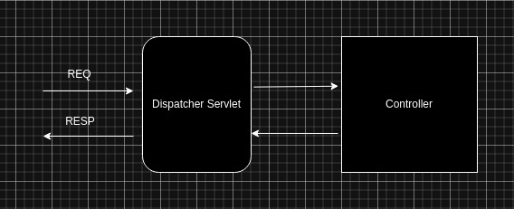

# Requirement
* Java
* Spring framework
* SpringBoot
* Servlet
  
# Spring Web MVC
Spring Web MVC(Model View Controller) adalah suatu pateren atau fitur di spring untuk mempermudah membuat java Web dengan Servlet.  
Saat kita membuat web dengan Java servlet, itu sangatlah ribet maka dari itu hadirlah sebuah java framework yang mempermudah pembuatan java web dengan nama Spring Web MVC.  
Spring Web MVC menganut pateren Model View Controller yang bisa mempermudah pengembangan Java web.  

# Dispatcher Servlet
Semua logic Spring Web Mvc, di atur oleh sebuah servlet dengan nama DispatcherServlet.  
DispatcherServlet ini adalah gerbang utama masuk keluarnya Request pada Spring Web MVC.  
  
Jadi Request akan masuk ke DispatcherServlet lalu [DispatcherServlet](https://docs.spring.io/spring-framework/docs/current/javadoc-api/org/springframework/web/servlet/DispatcherServlet.html) akan mendelegasikan atau meneruskan request tersebut ke Controller.  


# Controller
Untuk membuat contloler di Spring Web MVC kita bisa menggunakan annotation [@Controller](https://docs.spring.io/spring-framework/docs/current/javadoc-api/org/springframework/stereotype/Controller.html).  
Saat kita mengunakan annotation @Controller pada class yang ingin kita jadikan Controller maka kita tidak perlu lagi menambahkan annotation @Component, karena secara otomatis Spring Container akan membuatkan Spring Bean untuk contloller tersebut.  

``` java
@Controller
public class GreetingController {
    
}
```

# RequestMapping
Pada Java Servlet saat kita ingin menambahkan Routing maka kita akan menggunaakan annotation @WebServlet.  
Namun berbeda jikalau di Spring Web Mvc, pada spring web mvc jikalau kita ingin menambahkan routing maka kita bisa menggunakan annotation @RequestMappting pada method atau class yang akan kita gunakan sebagai Controller Handler

``` java
@Controller
public class GreetingController {
 
    @RequestMapping(path = "/greet")
    public void greeting(HttpServletResponse servletResponse) throws IOException {
        servletResponse.getWriter().println("Assalamuallaikum...");
    }
}
```
**NOTE** : 
> path pada @RequerstMapping wajib diisi, karena dari path itu lah kita akan menentukan url kita seperti apa. 

# Menjalankan Web
Spring Web MVC secara default mengembbed atau menambahkan Apache Tomcat sebagai Web Server.  
Maka dari itu kita tidak perlu lagi mempacage Applicaksi spring boot kita menajadi WAR file dan mendeploy nya di Apache tomcat.  
  
Secara default Spring Web MVC akan menggunakan port 8080 untuk menjalankan Apache Tomcat nya, jika kita ingin menggubah port nya maka kita bisa menggubahnya melalui `application.properties`

``` properties
server.port = 8091
```
Dan untuk menjalankanya kita bisa menjalankan perintah sebagai berikut :
``` bash
mvn spring-boot:run
```

Dan kita bisa mengakses controller kita tadi `http://localhost:8091/greet`

# HttpServletRequest & HttpServletResponse
Saat kita membuat controller method dan kita beri annotasi @RequestMapping, maka kita bisa menambahkan HttpServletRequest dan HttpServletResponse dan spring akan melakukan injection pada HttpServletRequest dan HttpServletResponse.  

``` java
@Controller
public class GreetingController {
 
    @RequestMapping(path = "/greet")
    public void greeting(HttpServletRequest request, HttpServletResponse response) throws IOException {
        if(Objects.nonNull(request.getParameter("name"))) response.getWriter().println("Assalamuallaikum ya ".concat(request.getParameter("name")));
        else
        response.getWriter().println("Assalmuallikum Brouther..");
    }
}
```

# MockMvc
Spring Web Mvc secara defaut menyediakan fitur Mocking yang bernama MockMvc, nah..  
MockMvc ini sangat membantu kita jikalau kita ingin melakukan testing terhadap controller kita dan sebagainya.  
  
Dengan menggunakan MockMvc kita tidak perlu lagi HTTP CLIENT misalnya seperti Insomnia, Postman, Web Brouser dan sebagainya untuk melakukan HTTP Request.    
Kita bisa membuat HTTP REQUEST dari MockMvc.  
  
Sebelum kita membaut MockMvc ada beberapa hal yang wajib dilakukan, diantaranya yaitu :
* Melakukan import static ModuleMockMvc
``` java
import static org.springframework.test.web.servlet.request.MockMvcRequestBuilders.*;
import static org.springframework.test.web.servlet.result.MockMvcResultMatchers.*;
import static org.springframework.test.web.servlet.result.MockMvcResultHandlers.*;
``` 

* Melakukan Auto Konfigurasi MockMvc, denga begitu Spring Container akan membuatkan MockMvc Bean secara otomatis.  
``` java

@AutoConfigureMockMvc // melakukan konfigurasi otomatis MockMvc
@SpringBootTest 
class SpringWebMvcApplicationTests {

	private @Autowired MockMvc mockMvc;

	@Test
	public void greetingNoParam() throws Exception {
		this.mockMvc.perform(
			get("/greet")
		).andExpectAll(
			status().isOk(),
			content().string(Matchers.containsString("Assalmuallikum Brouther"))
		);
	}

	@Test
	public void greetingWithParam() throws Exception {
		String name = "Abdillah";
		this.mockMvc.perform(
			get("/greet")
			.queryParam("name", name)
		).andExpectAll(
			status().isOk(),
			content().string(Matchers.containsString("Assalamuallaikum ya ".concat(name)))
		);
	}
}
```
**NOTE :**
> untuk lebih detail nya bisa kunjungi disini :
> https://docs.spring.io/spring-framework/docs/current/javadoc-api/org/springframework/test/web/servlet/MockMvc.html

> https://docs.spring.io/spring-framework/reference/testing/spring-mvc-test-framework/server-performing-requests.html

# Intregation Test
Saat kita menggunakan MockMvc, Spring tidak akan menjalankan Application Web kita.  
Jadi yang dilakukan spring hanyalah menyediakan mock Request dan Mock Response.  
  
Melakuakn Testing pada Pada appliaksi web denga keadaan server web menyala, aktivitas tersebut disebut **INTREGATION TESTING**.  
Integation Testing ini artinya kita menjalankan applikasi web kita secara seutuhnya, Server, Database, dan sebagainya harus nyala.  
  
Saat kita menggunakan Spring Web Mvc, selain kita memiliki fitur MockMvc kita juga diberikan [TestRestTemplate](https://docs.spring.io/spring-boot/docs/current/api/org/springframework/boot/test/web/client/TestRestTemplate.html) dan [RestTemplate](https://docs.spring.io/spring-framework/docs/current/javadoc-api/org/springframework/web/client/RestTemplate.html).  
  
Dengan menggunakan TestRestTemplate kita bisa menjalankan applikasi web kita secara otomatis saat melakukan intregation testing dan akan mematikan applikasi web kita ketika intregation testing selesai.

Untuk melakukan intregation testing, berikut ini hal-hal yang wajib dilakukan :
* Seting up port yang akan digunakan untuk intregation test
``` java
@SpringBootTest(webEnvironment = SpringBootTest.WebEnvironment.RANDOM_PORT)
public class TestGreetingControllerIntgrationtest { }
```
*NOTE* : *webEnvironment pada annotation @SpringBootTest diunakan untuk menentukan port yang akan diguanakan untuk intregation test*

Berikut ini 2 jenis port yang sering digunakan :
| Port          | description
|---------------|--------------
| RANDOM_PORT   | Spring akan mengenerate random port
| DEFINE_PORT   | Spring akan menggunakan port yang sudah didefine di `application.properties`

Untuk lebih detail nya bisa kunjungi disini :
https://docs.spring.io/spring-boot/docs/current/api/org/springframework/boot/test/context/SpringBootTest.WebEnvironment.html


* Mengambil port dari webEnvironment
Untuk mengambil port dari @SpringBootTest(webEnvironment = SpringBootTest.WebEnvironment.RANDOM_PORT) kita bisa menggunakan annotation @LocalServerPort.  

``` java
@SpringBootTest(webEnvironment = SpringBootTest.WebEnvironment.RANDOM_PORT)
public class TestGreetingControllerIntgrationtest {
    
    private @LocalServerPort Integer port;
}
```
* setelah itu kita bisa menggunakan [TestRestTemplate](https://docs.spring.io/spring-boot/docs/current/api/org/springframework/boot/test/web/client/TestRestTemplate.html) untuk melakukan Intregation Testing

``` java
@SpringBootTest(webEnvironment = SpringBootTest.WebEnvironment.RANDOM_PORT)
public class TestGreetingControllerIntgrationtest {
    
    private @LocalServerPort Integer port;

    private @Autowired TestRestTemplate testRestTemplate;

    private static final String HOST = "http://127.0.0.1";

    @Test
    public void testGreetingNoParam() {
        String url = HOST.concat(":"+String.valueOf(port)).concat("/greet");
        ResponseEntity<String> response = this.testRestTemplate.getForEntity(url, String.class);
        Assertions.assertEquals(HttpStatus.OK, response.getStatusCode());
        Assertions.assertNotNull(response.getBody());
        Assertions.assertEquals("Assalmuallikum Brouther..", response.getBody().trim());
    }

    @Test
    public void terGreetingWithParam() {
        String url = HOST.concat(":".concat(String.valueOf(port))).concat("/greet?name=Abdillah");
        ResponseEntity<String> response = this.testRestTemplate.getForEntity(url, String.class);
        Assertions.assertEquals(HttpStatus.OK, response.getStatusCode());
        Assertions.assertNotNull(response.getBody());
        Assertions.assertEquals("Assalamuallaikum ya Abdillah", response.getBody().trim());
    }
}
```